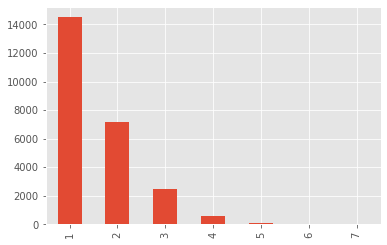
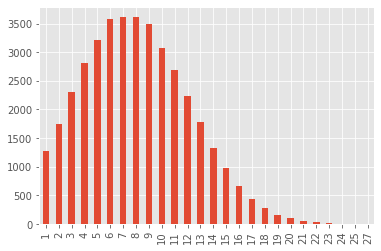
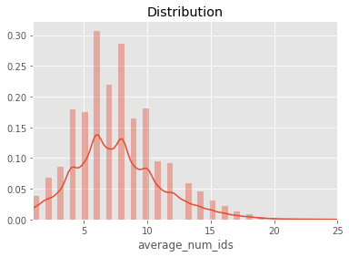

# Set up working dir


```python
import os

curr_dir = os.getcwd()
```


```python
purchase_history_path = curr_dir + '/purchase_history.csv'
item_to_id_path = curr_dir + '/item_to_id.csv'
```

# Import library


```python
from phuc import data_process, file
from phuc import visualization as vs

import pandas as pd
import numpy as np

from matplotlib import pyplot as plt
import seaborn as sns

%matplotlib inline
plt.style.use('ggplot')
```

# Process Data

### General Analyze


```python
# Read CSV file
purchase_history = data_process.read_csv(purchase_history_path)
item_to_id = data_process.read_csv(item_to_id_path)
```

    purchase_history.csv 's information:
    <class 'pandas.core.frame.DataFrame'>
    RangeIndex: 39474 entries, 0 to 39473
    Data columns (total 2 columns):
    user_id    39474 non-null int64
    id         39474 non-null object
    dtypes: int64(1), object(1)
    memory usage: 616.9+ KB
    None
    
    item_to_id.csv 's information:
    <class 'pandas.core.frame.DataFrame'>
    RangeIndex: 48 entries, 0 to 47
    Data columns (total 2 columns):
    Item_name    48 non-null object
    Item_id      48 non-null int64
    dtypes: int64(1), object(1)
    memory usage: 896.0+ bytes
    None
    


```python
num_of_rows_history = purchase_history.shape[0]
num_of_rows_item = item_to_id.shape[0]
```


```python
purchase_history.head()
```


<div>
<style scoped>
    .dataframe tbody tr th:only-of-type {
        vertical-align: middle;
    }

    .dataframe tbody tr th {
        vertical-align: top;
    }

    .dataframe thead th {
        text-align: right;
    }
</style>
<table border="1" class="dataframe">
  <thead>
    <tr style="text-align: right;">
      <th></th>
      <th>user_id</th>
      <th>id</th>
    </tr>
  </thead>
  <tbody>
    <tr>
      <th>0</th>
      <td>222087</td>
      <td>27,26</td>
    </tr>
    <tr>
      <th>1</th>
      <td>1343649</td>
      <td>6,47,17</td>
    </tr>
    <tr>
      <th>2</th>
      <td>404134</td>
      <td>18,12,23,22,27,43,38,20,35,1</td>
    </tr>
    <tr>
      <th>3</th>
      <td>1110200</td>
      <td>9,23,2,20,26,47,37</td>
    </tr>
    <tr>
      <th>4</th>
      <td>224107</td>
      <td>31,18,5,13,1,21,48,16,26,2,44,32,20,37,42,35,4...</td>
    </tr>
  </tbody>
</table>
</div>


```python
item_to_id.head()
```


<div>
<style scoped>
    .dataframe tbody tr th:only-of-type {
        vertical-align: middle;
    }

    .dataframe tbody tr th {
        vertical-align: top;
    }

    .dataframe thead th {
        text-align: right;
    }
</style>
<table border="1" class="dataframe">
  <thead>
    <tr style="text-align: right;">
      <th></th>
      <th>Item_name</th>
      <th>Item_id</th>
    </tr>
  </thead>
  <tbody>
    <tr>
      <th>0</th>
      <td>coffee</td>
      <td>43</td>
    </tr>
    <tr>
      <th>1</th>
      <td>tea</td>
      <td>23</td>
    </tr>
    <tr>
      <th>2</th>
      <td>juice</td>
      <td>38</td>
    </tr>
    <tr>
      <th>3</th>
      <td>soda</td>
      <td>9</td>
    </tr>
    <tr>
      <th>4</th>
      <td>sandwich loaves</td>
      <td>39</td>
    </tr>
  </tbody>
</table>
</div>


### user_id (purchase_history)


```python
purchase_history['user_id'].nunique()
```


    24885


```python
user_id = purchase_history['user_id'].value_counts().sort_index()
```


```python
user_id_duplicate_count= user_id.value_counts()
user_id_duplicate_count.plot(kind='bar')
print(user_id_duplicate_count)
```

    1    14496
    2     7155
    3     2458
    4      618
    5      130
    6       24
    7        4
    Name: user_id, dtype: int64





```python
purchase_history['id'][0]
```


    '27,26'


### item_to_id


```python
item_to_id['Item_id'].nunique()
```


    48


```python
item_to_id
```


<div>
<style scoped>
    .dataframe tbody tr th:only-of-type {
        vertical-align: middle;
    }

    .dataframe tbody tr th {
        vertical-align: top;
    }

    .dataframe thead th {
        text-align: right;
    }
</style>
<table border="1" class="dataframe">
  <thead>
    <tr style="text-align: right;">
      <th></th>
      <th>Item_name</th>
      <th>Item_id</th>
    </tr>
  </thead>
  <tbody>
    <tr>
      <th>0</th>
      <td>coffee</td>
      <td>43</td>
    </tr>
    <tr>
      <th>1</th>
      <td>tea</td>
      <td>23</td>
    </tr>
    <tr>
      <th>2</th>
      <td>juice</td>
      <td>38</td>
    </tr>
    <tr>
      <th>3</th>
      <td>soda</td>
      <td>9</td>
    </tr>
    <tr>
      <th>4</th>
      <td>sandwich loaves</td>
      <td>39</td>
    </tr>
    <tr>
      <th>5</th>
      <td>dinner rolls</td>
      <td>37</td>
    </tr>
    <tr>
      <th>6</th>
      <td>tortillas</td>
      <td>34</td>
    </tr>
    <tr>
      <th>7</th>
      <td>bagels</td>
      <td>13</td>
    </tr>
    <tr>
      <th>8</th>
      <td>canned vegetables</td>
      <td>28</td>
    </tr>
    <tr>
      <th>9</th>
      <td>spaghetti sauce</td>
      <td>26</td>
    </tr>
    <tr>
      <th>10</th>
      <td>ketchup</td>
      <td>41</td>
    </tr>
    <tr>
      <th>11</th>
      <td>cheeses</td>
      <td>21</td>
    </tr>
    <tr>
      <th>12</th>
      <td>eggs</td>
      <td>14</td>
    </tr>
    <tr>
      <th>13</th>
      <td>milk</td>
      <td>16</td>
    </tr>
    <tr>
      <th>14</th>
      <td>yogurt</td>
      <td>48</td>
    </tr>
    <tr>
      <th>15</th>
      <td>butter</td>
      <td>8</td>
    </tr>
    <tr>
      <th>16</th>
      <td>cereals</td>
      <td>11</td>
    </tr>
    <tr>
      <th>17</th>
      <td>flour</td>
      <td>30</td>
    </tr>
    <tr>
      <th>18</th>
      <td>sugar</td>
      <td>1</td>
    </tr>
    <tr>
      <th>19</th>
      <td>pasta</td>
      <td>31</td>
    </tr>
    <tr>
      <th>20</th>
      <td>waffles</td>
      <td>5</td>
    </tr>
    <tr>
      <th>21</th>
      <td>frozen vegetables</td>
      <td>22</td>
    </tr>
    <tr>
      <th>22</th>
      <td>ice cream</td>
      <td>36</td>
    </tr>
    <tr>
      <th>23</th>
      <td>poultry</td>
      <td>6</td>
    </tr>
    <tr>
      <th>24</th>
      <td>beef</td>
      <td>17</td>
    </tr>
    <tr>
      <th>25</th>
      <td>pork</td>
      <td>47</td>
    </tr>
    <tr>
      <th>26</th>
      <td>bananas</td>
      <td>46</td>
    </tr>
    <tr>
      <th>27</th>
      <td>berries</td>
      <td>40</td>
    </tr>
    <tr>
      <th>28</th>
      <td>cherries</td>
      <td>25</td>
    </tr>
    <tr>
      <th>29</th>
      <td>grapefruit</td>
      <td>20</td>
    </tr>
    <tr>
      <th>30</th>
      <td>apples</td>
      <td>32</td>
    </tr>
    <tr>
      <th>31</th>
      <td>broccoli</td>
      <td>44</td>
    </tr>
    <tr>
      <th>32</th>
      <td>carrots</td>
      <td>10</td>
    </tr>
    <tr>
      <th>33</th>
      <td>cauliflower</td>
      <td>45</td>
    </tr>
    <tr>
      <th>34</th>
      <td>cucumbers</td>
      <td>42</td>
    </tr>
    <tr>
      <th>35</th>
      <td>lettuce</td>
      <td>2</td>
    </tr>
    <tr>
      <th>36</th>
      <td>laundry detergent</td>
      <td>18</td>
    </tr>
    <tr>
      <th>37</th>
      <td>dishwashing</td>
      <td>27</td>
    </tr>
    <tr>
      <th>38</th>
      <td>paper towels</td>
      <td>24</td>
    </tr>
    <tr>
      <th>39</th>
      <td>toilet paper</td>
      <td>33</td>
    </tr>
    <tr>
      <th>40</th>
      <td>aluminum foil</td>
      <td>15</td>
    </tr>
    <tr>
      <th>41</th>
      <td>sandwich bags</td>
      <td>7</td>
    </tr>
    <tr>
      <th>42</th>
      <td>shampoo</td>
      <td>12</td>
    </tr>
    <tr>
      <th>43</th>
      <td>soap</td>
      <td>35</td>
    </tr>
    <tr>
      <th>44</th>
      <td>hand soap</td>
      <td>29</td>
    </tr>
    <tr>
      <th>45</th>
      <td>shaving cream</td>
      <td>19</td>
    </tr>
    <tr>
      <th>46</th>
      <td>baby items</td>
      <td>4</td>
    </tr>
    <tr>
      <th>47</th>
      <td>pet items</td>
      <td>3</td>
    </tr>
  </tbody>
</table>
</div>


### Engineer id (purchase_history)


```python
# convert string to list
purchase_history['id'] = purchase_history['id'].apply(lambda string : [int(x) for x in string.split(',')])
```


```python
type(purchase_history['id'][0])
```


    list


### Create number_of_id each time user go to stored


```python
purchase_history['number_of_id'] = purchase_history['id'].apply(lambda _list : len(_list))
```


```python
purchase_history.head()
```


<div>
<style scoped>
    .dataframe tbody tr th:only-of-type {
        vertical-align: middle;
    }

    .dataframe tbody tr th {
        vertical-align: top;
    }

    .dataframe thead th {
        text-align: right;
    }
</style>
<table border="1" class="dataframe">
  <thead>
    <tr style="text-align: right;">
      <th></th>
      <th>user_id</th>
      <th>id</th>
      <th>number_of_id</th>
    </tr>
  </thead>
  <tbody>
    <tr>
      <th>0</th>
      <td>222087</td>
      <td>[27, 26]</td>
      <td>2</td>
    </tr>
    <tr>
      <th>1</th>
      <td>1343649</td>
      <td>[6, 47, 17]</td>
      <td>3</td>
    </tr>
    <tr>
      <th>2</th>
      <td>404134</td>
      <td>[18, 12, 23, 22, 27, 43, 38, 20, 35, 1]</td>
      <td>10</td>
    </tr>
    <tr>
      <th>3</th>
      <td>1110200</td>
      <td>[9, 23, 2, 20, 26, 47, 37]</td>
      <td>7</td>
    </tr>
    <tr>
      <th>4</th>
      <td>224107</td>
      <td>[31, 18, 5, 13, 1, 21, 48, 16, 26, 2, 44, 32, ...</td>
      <td>20</td>
    </tr>
  </tbody>
</table>
</div>


```python
number_of_id = purchase_history['number_of_id'].value_counts().sort_index()
number_of_id.plot(kind= 'bar')
print(number_of_id)
```

    1     1268
    2     1751
    3     2297
    4     2819
    5     3215
    6     3586
    7     3615
    8     3609
    9     3496
    10    3068
    11    2695
    12    2233
    13    1783
    14    1322
    15     973
    16     661
    17     439
    18     276
    19     156
    20     103
    21      50
    22      35
    23      13
    24       6
    25       3
    27       2
    Name: number_of_id, dtype: int64





# Analyze user that go multiple time


```python
user_id_duplicate = user_id[user_id > 1].index
```


```python
purchase_history = purchase_history.sort_values('user_id').reset_index(drop = True)
user_id= user_id.sort_index()
```


```python
purchase_history[purchase_history['user_id'] == user_id_duplicate[2]]
```


<div>
<style scoped>
    .dataframe tbody tr th:only-of-type {
        vertical-align: middle;
    }

    .dataframe tbody tr th {
        vertical-align: top;
    }

    .dataframe thead th {
        text-align: right;
    }
</style>
<table border="1" class="dataframe">
  <thead>
    <tr style="text-align: right;">
      <th></th>
      <th>user_id</th>
      <th>id</th>
      <th>number_of_id</th>
    </tr>
  </thead>
  <tbody>
    <tr>
      <th>13</th>
      <td>553</td>
      <td>[2, 46, 20, 4]</td>
      <td>4</td>
    </tr>
    <tr>
      <th>14</th>
      <td>553</td>
      <td>[15, 7, 37, 34, 9]</td>
      <td>5</td>
    </tr>
    <tr>
      <th>15</th>
      <td>553</td>
      <td>[28, 41, 23, 43, 40, 1, 36, 22, 35, 24, 15]</td>
      <td>11</td>
    </tr>
  </tbody>
</table>
</div>


```python
purchase_history.head()
```


<div>
<style scoped>
    .dataframe tbody tr th:only-of-type {
        vertical-align: middle;
    }

    .dataframe tbody tr th {
        vertical-align: top;
    }

    .dataframe thead th {
        text-align: right;
    }
</style>
<table border="1" class="dataframe">
  <thead>
    <tr style="text-align: right;">
      <th></th>
      <th>user_id</th>
      <th>id</th>
      <th>number_of_id</th>
    </tr>
  </thead>
  <tbody>
    <tr>
      <th>0</th>
      <td>47</td>
      <td>[3, 4, 2, 13, 44, 16, 24, 28, 23, 45, 15, 46, 25]</td>
      <td>13</td>
    </tr>
    <tr>
      <th>1</th>
      <td>68</td>
      <td>[23, 10, 42, 39, 19, 6, 17, 25]</td>
      <td>8</td>
    </tr>
    <tr>
      <th>2</th>
      <td>113</td>
      <td>[46, 33, 30, 32, 43, 9, 38, 21, 15, 3, 25]</td>
      <td>11</td>
    </tr>
    <tr>
      <th>3</th>
      <td>123</td>
      <td>[4, 10, 27, 18]</td>
      <td>4</td>
    </tr>
    <tr>
      <th>4</th>
      <td>223</td>
      <td>[17, 2, 22, 38]</td>
      <td>4</td>
    </tr>
  </tbody>
</table>
</div>


```python
# Save engineered purchase_history
purchase_history_pkl_path = curr_dir + '/generated/' + 'purchase_history.pkl'
```


```python
file.save_pickle(purchase_history_pkl_path,purchase_history, True)
```

    Directory  /home/phuc/Desktop/Work/Data Sience/Project/Cluster Item selling/generated  already exists
    ___MEMORY USAGE AFTER COMPLETION:___
    reduced df from 0.9036 MB to 0.4895 MB 
    This is  54.17285837315726 % of the initial size
    Saved file purchase_history.pkl


# Create unique_user file


```python
unique_user = {}
index = 0

for unique_id in user_id.index:
    same_user_id = True
    unique_user[unique_id] = purchase_history.iloc[index,1].copy()
    while same_user_id:
        if index == num_of_rows_history -1:
            break
        else:
            index += 1
        if purchase_history.iloc[index,0] != unique_id:
            same_user_id = False
        else:
            unique_user[unique_id] += purchase_history.iloc[index,1]
    unique_user[unique_id] = list(set(unique_user[unique_id] ))
```


```python
unique_user = pd.DataFrame(unique_user.items())
unique_user.columns = ['user_id', 'id_items']
```


```python
unique_user['vist_store'] = user_id.values
```


```python
unique_user['number_of_id'] = unique_user['id_items'].apply(lambda _list : len(_list))
```


```python
unique_user['average_num_ids'] = (unique_user['number_of_id'] / unique_user['vist_store'])
```


```python
unique_user = data_process.memory.Reducer(round_up=True).reduce(unique_user)
```

    ___MEMORY USAGE AFTER COMPLETION:___
    reduced df from 0.9494 MB to 0.3561 MB 
    This is  37.508035936708964 % of the initial size


```python

unique_user_path = curr_dir + '/generated/' + 'unique_user.pkl'
```


```python
unique_user.head()
```


<div>
<style scoped>
    .dataframe tbody tr th:only-of-type {
        vertical-align: middle;
    }

    .dataframe tbody tr th {
        vertical-align: top;
    }

    .dataframe thead th {
        text-align: right;
    }
</style>
<table border="1" class="dataframe">
  <thead>
    <tr style="text-align: right;">
      <th></th>
      <th>user_id</th>
      <th>id_items</th>
      <th>number_of_id</th>
      <th>vist_store</th>
      <th>average_num_ids</th>
    </tr>
  </thead>
  <tbody>
    <tr>
      <th>0</th>
      <td>47</td>
      <td>[2, 3, 4, 44, 13, 45, 15, 16, 46, 23, 24, 25, 28]</td>
      <td>13</td>
      <td>1</td>
      <td>13</td>
    </tr>
    <tr>
      <th>1</th>
      <td>68</td>
      <td>[6, 39, 10, 42, 17, 19, 23, 25]</td>
      <td>8</td>
      <td>1</td>
      <td>8</td>
    </tr>
    <tr>
      <th>2</th>
      <td>113</td>
      <td>[32, 33, 3, 38, 9, 43, 46, 15, 21, 25, 30]</td>
      <td>11</td>
      <td>1</td>
      <td>11</td>
    </tr>
    <tr>
      <th>3</th>
      <td>123</td>
      <td>[18, 10, 27, 4]</td>
      <td>4</td>
      <td>1</td>
      <td>4</td>
    </tr>
    <tr>
      <th>4</th>
      <td>223</td>
      <td>[32, 1, 2, 35, 38, 6, 41, 45, 17, 22, 29]</td>
      <td>11</td>
      <td>2</td>
      <td>6</td>
    </tr>
  </tbody>
</table>
</div>


```python
file.save_pickle(unique_user_path,unique_user, True)
```

    Directory  /home/phuc/Desktop/Work/Data Sience/Project/Cluster Item selling/generated  already exists
    ___MEMORY USAGE AFTER COMPLETION:___
    reduced df from 0.3561 MB to 0.3561 MB 
    This is  100.0 % of the initial size
    Saved file unique_user.pkl


# Analyze unique_user


```python
unique_user.head()
```


<div>
<style scoped>
    .dataframe tbody tr th:only-of-type {
        vertical-align: middle;
    }

    .dataframe tbody tr th {
        vertical-align: top;
    }

    .dataframe thead th {
        text-align: right;
    }
</style>
<table border="1" class="dataframe">
  <thead>
    <tr style="text-align: right;">
      <th></th>
      <th>user_id</th>
      <th>id_items</th>
      <th>number_of_id</th>
      <th>vist_store</th>
      <th>average_num_ids</th>
    </tr>
  </thead>
  <tbody>
    <tr>
      <th>0</th>
      <td>47</td>
      <td>[2, 3, 4, 44, 13, 45, 15, 16, 46, 23, 24, 25, 28]</td>
      <td>13</td>
      <td>1</td>
      <td>13</td>
    </tr>
    <tr>
      <th>1</th>
      <td>68</td>
      <td>[6, 39, 10, 42, 17, 19, 23, 25]</td>
      <td>8</td>
      <td>1</td>
      <td>8</td>
    </tr>
    <tr>
      <th>2</th>
      <td>113</td>
      <td>[32, 33, 3, 38, 9, 43, 46, 15, 21, 25, 30]</td>
      <td>11</td>
      <td>1</td>
      <td>11</td>
    </tr>
    <tr>
      <th>3</th>
      <td>123</td>
      <td>[18, 10, 27, 4]</td>
      <td>4</td>
      <td>1</td>
      <td>4</td>
    </tr>
    <tr>
      <th>4</th>
      <td>223</td>
      <td>[32, 1, 2, 35, 38, 6, 41, 45, 17, 22, 29]</td>
      <td>11</td>
      <td>2</td>
      <td>6</td>
    </tr>
  </tbody>
</table>
</div>


```python
unique_user[unique_user['number_of_id'] > 35]
```


<div>
<style scoped>
    .dataframe tbody tr th:only-of-type {
        vertical-align: middle;
    }

    .dataframe tbody tr th {
        vertical-align: top;
    }

    .dataframe thead th {
        text-align: right;
    }
</style>
<table border="1" class="dataframe">
  <thead>
    <tr style="text-align: right;">
      <th></th>
      <th>user_id</th>
      <th>id_items</th>
      <th>number_of_id</th>
      <th>vist_store</th>
      <th>average_num_ids</th>
    </tr>
  </thead>
  <tbody>
    <tr>
      <th>1032</th>
      <td>64998</td>
      <td>[1, 2, 3, 4, 5, 6, 7, 10, 11, 13, 17, 18, 19, ...</td>
      <td>37</td>
      <td>6</td>
      <td>6</td>
    </tr>
    <tr>
      <th>3022</th>
      <td>182623</td>
      <td>[2, 3, 5, 6, 7, 8, 10, 13, 14, 15, 16, 17, 18,...</td>
      <td>36</td>
      <td>5</td>
      <td>7</td>
    </tr>
    <tr>
      <th>4445</th>
      <td>269335</td>
      <td>[1, 2, 3, 4, 6, 9, 10, 11, 12, 13, 14, 17, 18,...</td>
      <td>37</td>
      <td>6</td>
      <td>6</td>
    </tr>
    <tr>
      <th>6111</th>
      <td>367872</td>
      <td>[1, 2, 3, 4, 5, 9, 10, 11, 13, 17, 18, 19, 20,...</td>
      <td>36</td>
      <td>6</td>
      <td>6</td>
    </tr>
    <tr>
      <th>6291</th>
      <td>377284</td>
      <td>[1, 2, 3, 4, 6, 9, 10, 12, 13, 14, 15, 16, 17,...</td>
      <td>38</td>
      <td>5</td>
      <td>8</td>
    </tr>
    <tr>
      <th>6623</th>
      <td>397623</td>
      <td>[1, 2, 3, 5, 6, 7, 8, 9, 11, 12, 13, 14, 15, 1...</td>
      <td>36</td>
      <td>5</td>
      <td>7</td>
    </tr>
    <tr>
      <th>9918</th>
      <td>599172</td>
      <td>[1, 2, 3, 5, 6, 7, 8, 9, 10, 12, 13, 14, 15, 1...</td>
      <td>37</td>
      <td>6</td>
      <td>6</td>
    </tr>
    <tr>
      <th>10907</th>
      <td>659201</td>
      <td>[1, 2, 3, 4, 5, 6, 7, 8, 9, 10, 11, 14, 16, 17...</td>
      <td>36</td>
      <td>4</td>
      <td>9</td>
    </tr>
    <tr>
      <th>12060</th>
      <td>728584</td>
      <td>[1, 2, 3, 6, 7, 8, 9, 10, 11, 13, 14, 16, 17, ...</td>
      <td>36</td>
      <td>4</td>
      <td>9</td>
    </tr>
    <tr>
      <th>12656</th>
      <td>764759</td>
      <td>[1, 2, 3, 4, 6, 7, 8, 9, 10, 11, 12, 13, 14, 1...</td>
      <td>36</td>
      <td>4</td>
      <td>9</td>
    </tr>
    <tr>
      <th>13705</th>
      <td>828721</td>
      <td>[1, 2, 3, 4, 5, 6, 7, 8, 9, 10, 11, 12, 13, 14...</td>
      <td>41</td>
      <td>6</td>
      <td>7</td>
    </tr>
    <tr>
      <th>14835</th>
      <td>897787</td>
      <td>[1, 2, 3, 4, 5, 6, 8, 9, 10, 12, 13, 14, 15, 1...</td>
      <td>38</td>
      <td>4</td>
      <td>10</td>
    </tr>
    <tr>
      <th>15193</th>
      <td>917199</td>
      <td>[1, 2, 3, 4, 6, 8, 9, 10, 13, 14, 17, 18, 19, ...</td>
      <td>36</td>
      <td>6</td>
      <td>6</td>
    </tr>
    <tr>
      <th>18041</th>
      <td>1085323</td>
      <td>[1, 2, 3, 5, 6, 7, 8, 9, 10, 12, 13, 14, 16, 1...</td>
      <td>37</td>
      <td>4</td>
      <td>9</td>
    </tr>
    <tr>
      <th>18316</th>
      <td>1100981</td>
      <td>[2, 3, 5, 6, 8, 9, 10, 11, 12, 13, 14, 15, 17,...</td>
      <td>38</td>
      <td>5</td>
      <td>8</td>
    </tr>
    <tr>
      <th>21088</th>
      <td>1273957</td>
      <td>[1, 2, 3, 4, 5, 6, 8, 10, 11, 12, 13, 14, 15, ...</td>
      <td>38</td>
      <td>4</td>
      <td>10</td>
    </tr>
    <tr>
      <th>22152</th>
      <td>1341188</td>
      <td>[1, 2, 3, 4, 6, 7, 10, 11, 12, 13, 14, 16, 17,...</td>
      <td>36</td>
      <td>5</td>
      <td>7</td>
    </tr>
  </tbody>
</table>
</div>


User_id that has the buy __the most kinds of items__


```python
user_id_max = unique_user['number_of_id'].idxmax()
id_max = unique_user['number_of_id'].max()
print('User_id: {} that has the buy the most kinds of items: {}'.format(user_id_max,id_max))
```

    User_id: 13705 that has the buy the most kinds of items: 41


```python
unique_user['average_num_ids'].describe()
```


    count    24885.000000
    mean         7.666144
    std          3.465089
    min          1.000000
    25%          5.000000
    50%          7.000000
    75%         10.000000
    max         25.000000
    Name: average_num_ids, dtype: float64


```python
vs.distribution(unique_user['average_num_ids'])
```




